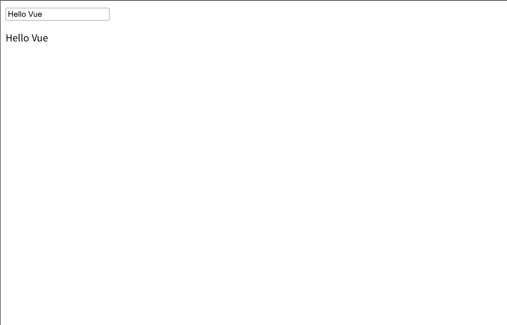
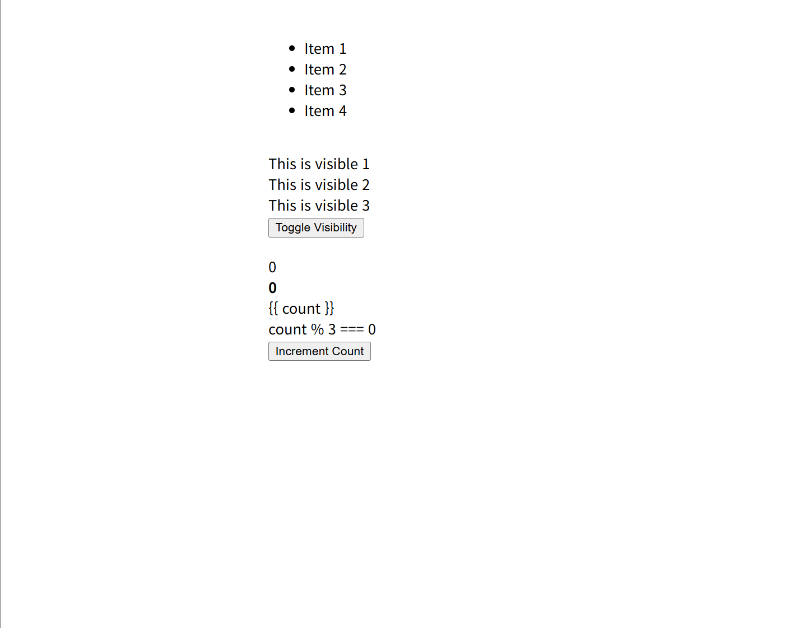
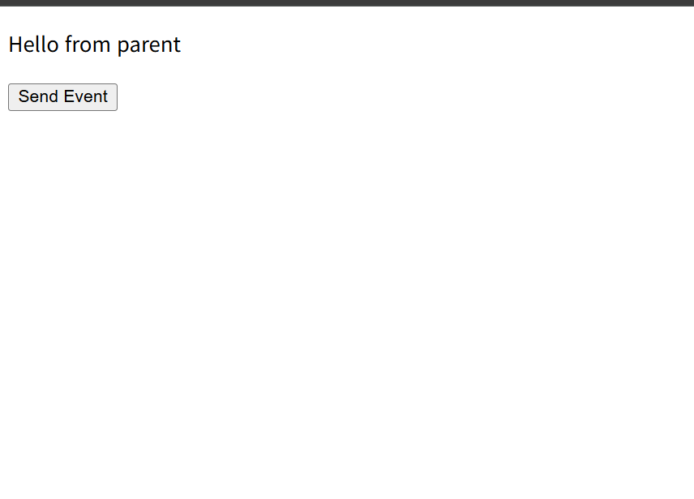
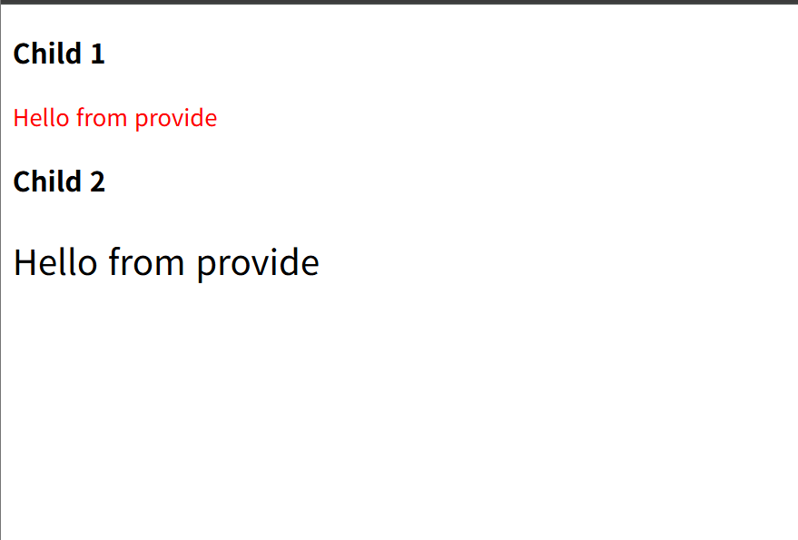
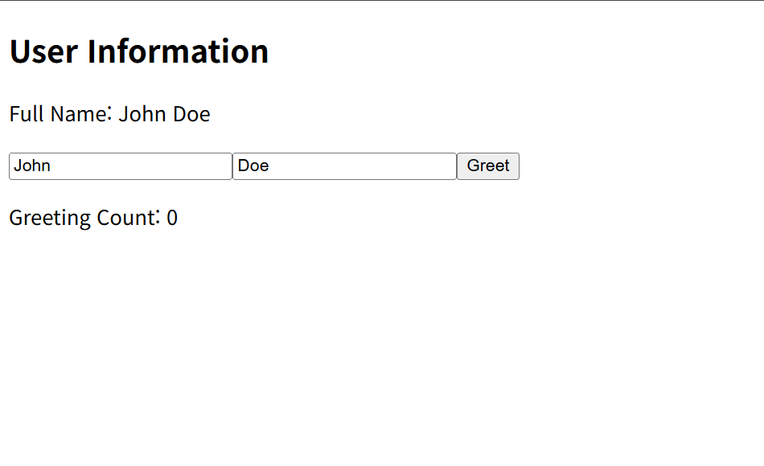
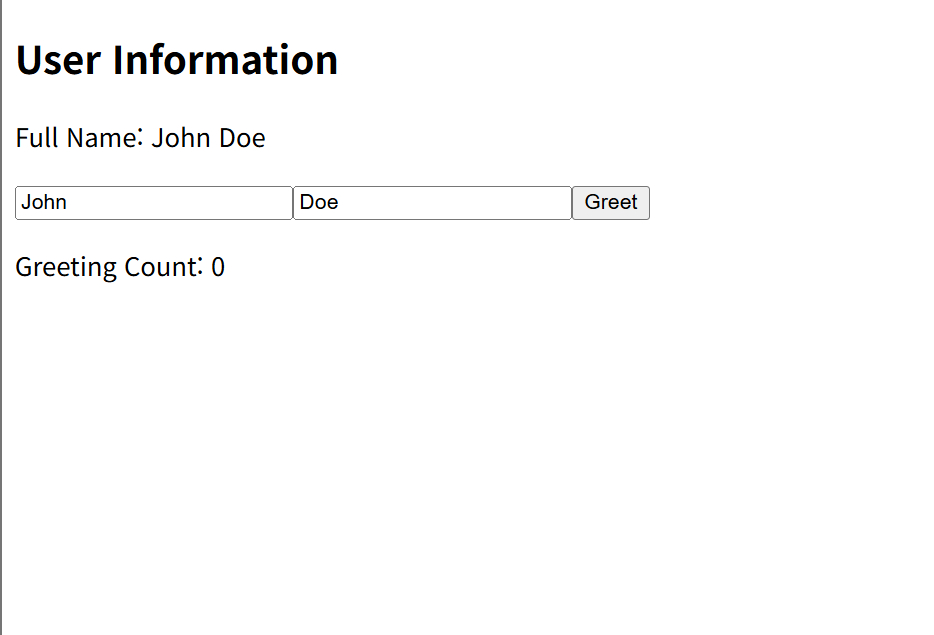
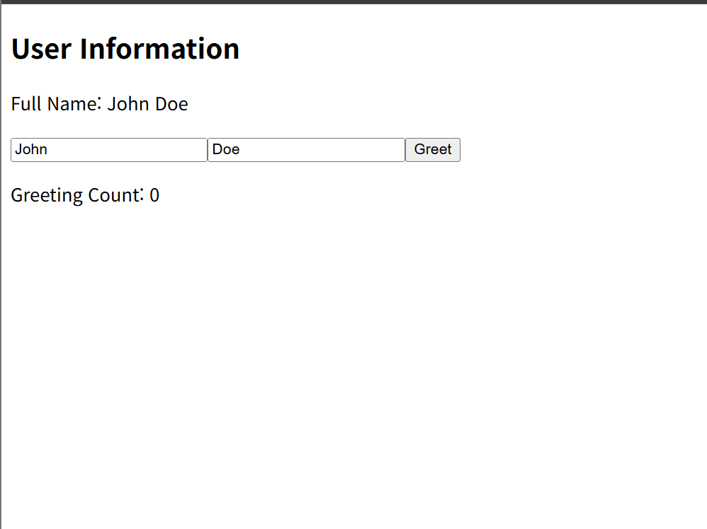
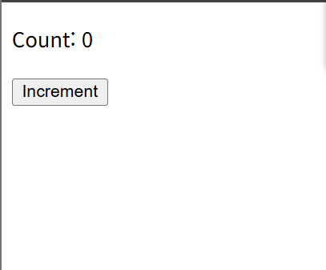
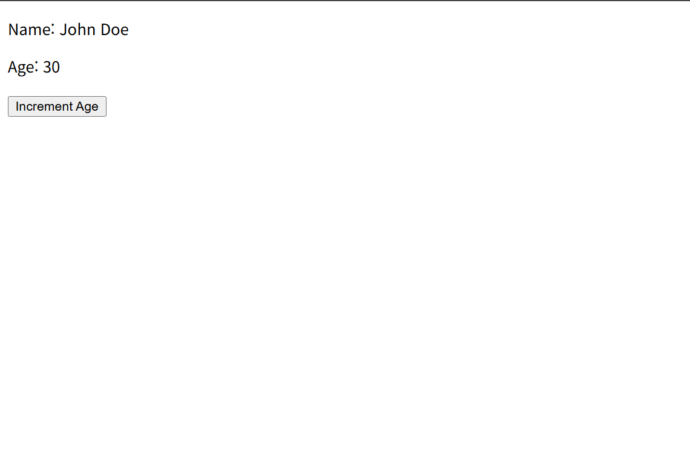
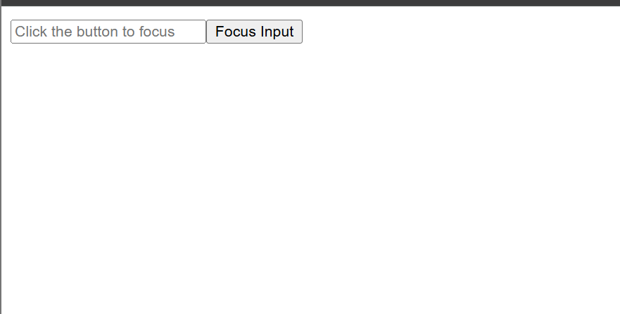

# vue-demo

## Project setup
```
npm install
```

### Compiles and hot-reloads for development
```
npm run serve
```

### Compiles and minifies for production
```
npm run build
```

### Lints and fixes files
```
npm run lint
```

### Customize configuration
See [Configuration Reference](https://cli.vuejs.org/config/).

## Vue 3 변환 내역

1. `E-01-instance.vue`

- 기존 Options API의 data() 옵션을 Vue 3의 <script setup> 내 ref를 사용하도록 변환했습니다.

- name 옵션은 <script setup> 사용 시 파일명을 기반으로 자동 설정되므로 제거했습니다.


2. `E-02-reactive.vue`

- data 옵션을 ref로 변환했습니다.

- computed 옵션을 computed() 함수로 변환했습니다.

- mounted 라이프사이클 훅을 onMounted() 함수로 대체했습니다.


3. `E-03-binding.vue`

- data 옵션의 message를 ref로 변환했습니다.

- v-model은 ref와 직접 바인딩되도록 유지했습니다.



4. `E-04-directives.vue`

- data 옵션의 isVisible, items, count를 모두 ref로 변환했습니다.

- 템플릿의 디렉티브는 Vue 3에서도 동일하게 작동하므로 수정하지 않았습니다.



5. `ChildComponent.vue`

- props 옵션을 defineProps 매크로로 변환했습니다.

- $emit 사용을 위해 defineEmits 매크로를 선언하고, 템플릿에서 emit()을 사용하도록 수정했습니다.

- defineProps와 defineEmits가 no-undef ESLint 오류를 발생시키지 않도록 eslint-disable-next-line 주석을 추가했습니다.

6. `ParentComponent.vue (E05)`

- data 옵션을 ref로 변환했습니다.

- methods 옵션의 handleEvent 함수를 <script setup> 내의 일반 함수로 변환했습니다.

- components 옵션은 <script setup>에서 import된 컴포넌트가 자동으로 등록되므로 제거했습니다.



7. `ChildComponent1.vue`

- inject 옵션을 inject() 함수로 변환했습니다.

- components 옵션은 <script setup>에서 자동으로 등록되므로 제거했습니다.

8. `ChildComponent2.vue`

- inject 옵션을 inject() 함수로 변환했습니다.

9. `ParentComponent.vue (E06)`

- provide 옵션을 provide() 함수로 변환했습니다.

- name 옵션과 components 옵션은 <script setup>에서 불필요하므로 제거했습니다.



10. `E-07-Options-API.vue`

- props 옵션을 defineProps 매크로로 변환했습니다.

- data 옵션을 ref로 변환했습니다.

- computed 옵션을 computed() 함수로 변환했습니다.

- methods를 <script setup> 내의 일반 함수로 변환했습니다.

- watch 옵션을 watch() 함수로 변환했습니다.

- 모든 라이프사이클 훅(mounted, updated 등)을 Composition API 훅(onMounted, onUpdated 등)으로 대체했습니다.

- beforeCreate 및 created 훅의 console.log는 <script setup>의 최상위 레벨(setup 실행 시점)로 이동했습니다.

- defineProps가 no-undef ESLint 오류를 발생시키지 않도록 eslint-disable-next-line 주석을 추가했습니다.



11. `E-08-composition-api.vue`

- Vue 2의 setup() 함수 내부에 있던 로직을 Vue 3의 <script setup> 최상위 레벨로 이동했습니다.

- props 옵션을 defineProps 매크로로 변환하고 ESLint 주석을 추가했습니다.

- setup() 함수와 return 문을 제거했습니다.



12. `E-09-composition-API2.vue`

- 이 파일은 이미 Vue 3 <script setup> 문법을 사용하고 있었습니다.

- 불필요한 export default { name: ... } 스크립트 블록을 제거했습니다.

- defineProps는 컴파일러 매크로이므로 잘못 사용된 import { defineProps } from 'vue' 구문을 제거했습니다.

- defineProps에 eslint-disable-next-line no-undef 주석을 추가했습니다.



13. `E-10-ref.vue`

- Vue 2의 setup() 함수 로직을 <script setup>의 최상위 레벨로 이동했습니다.
- 불필요한 export default, name 옵션, return 문을 제거했습니다.



14. `E-11-reactive.vue`

- Vue 2의 setup() 함수 로직을 <script setup>의 최상위 레벨로 이동했습니다.

- 불필요한 export default, name 옵션, return 문을 제거했습니다.



15. `E-12-ref-component.vue`

- Vue 2의 setup() 함수 로직을 <script setup>의 최상위 레벨로 이동했습니다.

- 템플릿의 ref="inputField" 속성이 스크립트의 const inputField = ref(null)와 자동으로 연결됩니다.

- 불필요한 export default, name 옵션, return 문을 제거했습니다.


